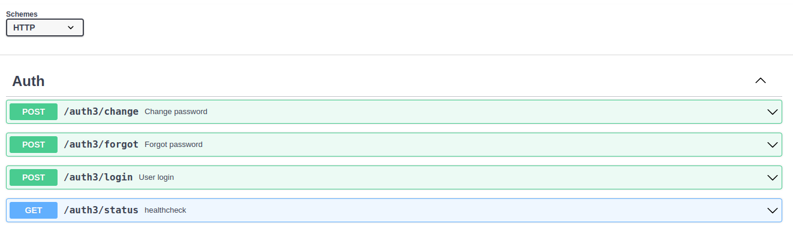
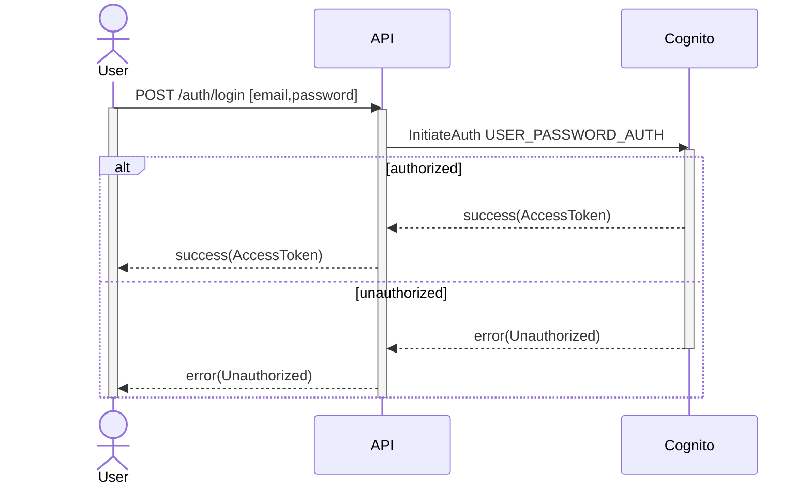
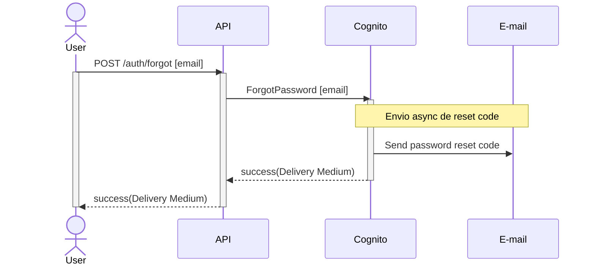
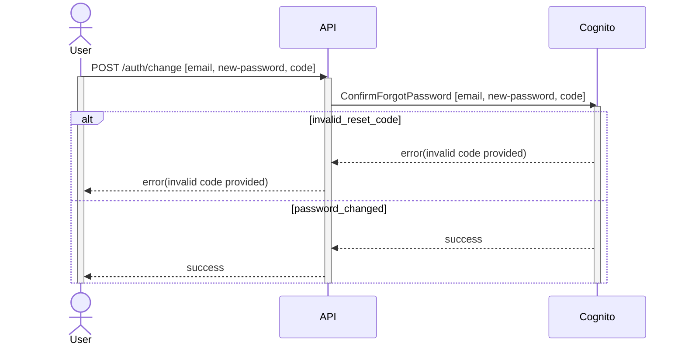
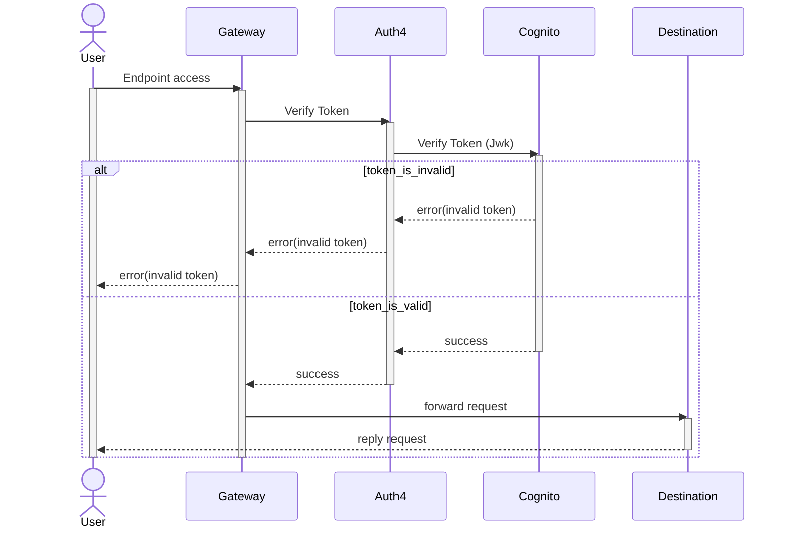

# Auth3

Auth3 é uma api para autenticação de usuários integrada ao AWS Cognito.

## Início Rápido

```bash
git clone https://github.com/realfabecker/auth3 auth3
cd auth3/backend
docker-compose up 
```

## Instalação e Uso

O uso recomendado do projeto é por seu ambiente [Docker][docker-link]. Pode-se também ser realizada instalação manual,
porém essa irá exigir a instalação local em seu ambiente do [Go 1.18][golang-link].

Para ambas as situações e necessário se assegurar da correta configuração das [variáveis de ambiente][aws-env-link] base
para integração com as apis da aws.

### Execução a partir de containers Docker

Clone o repositório em seu ambiente local e realize a compilação do projeto:

```bash
#!/bin/bash

docker compose build
```

Com o projeto disponível será possível inicializar a ambiente com suas configurações padrão:

```bash
#!/bin/bash

docker compose up
```

### Execução local com Golang

Assegure-se de ter o [Go 1.18][golang-link] devidamente instalado caso optado por não utilizar os containers do projeto.

Tendo realizado o clone do projeto realize a instalação das dependências de aplicação

```bash
#!/bin/bash

go mod download
```

Instale também as dependências de desenvolvimento para viabilizar o trabalho em ambiente local

```bash
#!/bin/bash

bash dev.bash
```

Crie um arquivo .env local para desenvolvimento e exporte suas configurações

```bash
#!/bin/bash

cat <<'EOL' > .env.local
APP_PORT=3001
APP_NAME=auth3
APP_HOST=localhost:3001
COGNITO_CLIENT_ID=123456
COGNITO_JWK_URL=https://cognito-idp.us-east-1.amazonaws.com/us-east-123456/.well-known/jwks.json
EOL

export $(cat .env.local)
```

Com isso inicie o projeto em modo [watch][go-air-link] considerando cenário de desenvolvimento

```bash
#!/bin/bash

air -c air.toml
```

### Acesso ao projeto localmente

A partir da instalação do projeto este terá sua interface http na porta 3001

```bash
#!/bin/bash

curl -v http://localhost:3001/auth3/status
```

A interface openapi do projeto pode ser acessada por http://localhost:3001/docs



## Compilação

Esse serviço pode ser compilado considerando os seguintes cenários de execução:

* Execução como api HTTP

```bash
#!/bin/bash

cd backend
make build-http
```

* Execução como função Lambda

```bash
#!/bin/bash

cd backend
make build-lambda
```

* Execução como autorizador lambda

```bash
#!/bin/bash

cd backend
make build-auth4
```

A compilação como serviço **http** permite tanto seu uso em produção quanto seu desenvolvimento local, já a compilação
como função **lambda** permite apenas o uso em produção.

A compilação como auth4 permite o uso do aplicativo em contexto de middleware de autorização das chamadas realizadas por
meio de uma api gateway, responsável por validação de tokens gerados em contexto http ou lambda.

## Diagramas de Sequência

### /auth/login



### /auth/forgot



## /auth/change



## auth4



## Publicação

A publicação desse serviço em produção deve ser realizada por meio do projeto [caterpillar][caterpillar-link].

## Dependências

* [Fiber](https://docs.gofiber.io/) - Web framework
* [dig](https://github.com/uber-go/dig) - Injeção de dependências
* [swag](https://github.com/swaggo/swag) - Documentação openapi

## Contribuições

Refira-se ao guia de [contribuições](./docs/CONTRIBUTING.md) para detalhes de como contribuir para o projeto.

## Versionamento

O projeto utilizada [SemVer](https://semver.org/) para o versionamento. Para todas as versões disponíveis verifique as
[tags nesse repositório](https://github.com/realfabecker/auth3/tags).

## Licença

Este projeto considera a licença MIT. Verifique a [Licença](LICENSE.md) para mais informações.


[docker-link]: https://docs.docker.com/engine/install/

[golang-link]: https://go.dev/doc/install

[go-air-link]: https://github.com/cosmtrek/air

[aws-env-link]: https://docs.aws.amazon.com/cli/latest/userguide/cli-configure-envvars.html

[aws-cognito-link]: https://aws.amazon.com/pt/cognito/

[auth3-link]: https://github.com/realfabecker/auth3

[caterpillar-link]: https://github.com/realfabecker/caterpillar