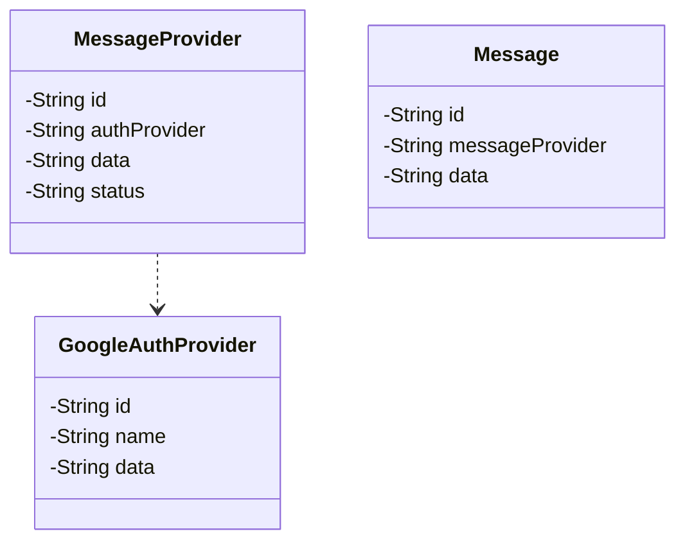
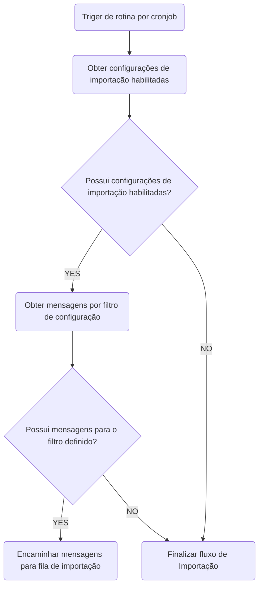
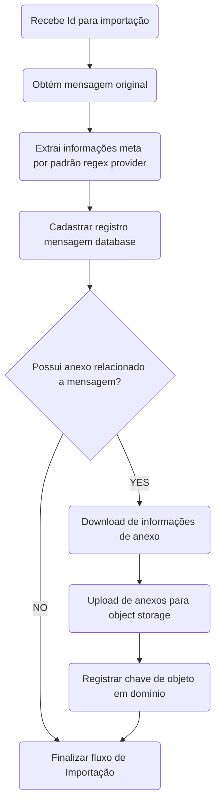

# mailbot

## Diagramas de entidade

```mermaid
classDiagram
    MessageProvider ..> GoogleAuthProvider

    class GoogleAuthProvider {
        -String id
        -String name
        -String data
    }

    class MessageProvider {
        -String id
        -String authProvider
        -String data
        -String status
    }

    class Message {
        -String id
        -String messageProvider
        -String data
    }
```

## Diagramas de fluxo

* Relacionar mensagens para fluxo de importação

```mermaid
flowchart TD
    Start(Triger de rotina por cronjob) --> Provedores(Obter configurações de importação habilitadas)
    Provedores --> D1{Possui configurações de importação habilitadas?}
    D1 -- YES  --> Mensagens(Obter mensagens por filtro de configuração)
    D1 -- NO --> End
    End(Finalizar fluxo de Importação)
    Mensagens --> D2{Possui mensagens para o filtro definido?}
    D2 -- YES --> Enfileirar(Encaminhar mensagens para fila de importação)
    D2 -- NO --> End
```

* Processar mensagem por rotina de importação

```mermaid
flowchart TD
    Start(Recebe Id para importação) --> Consulta(Obtém mensagem original)
    Consulta --> Extrair(Extrai informações meta por padrão regex provider)
    Extrair --> Gravar(Cadastrar registro mensagem database)
    Gravar --> D1{Possui anexo relacionado a mensagem?}
    D1 -- YES --> Download(Download de informações de anexo)
    D1 -- NO --> End(Finalizar fluxo de Importação)
    Download --> S3(Upload de anexos para object storage)
    S3 --> GravarS3(Registrar chave de objeto em domínio)
    GravarS3 --> End
    
```